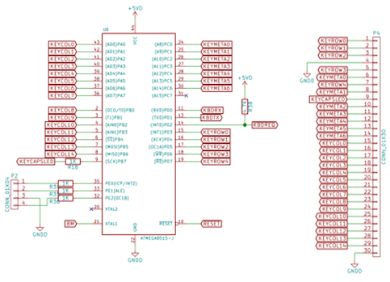

# Amiga 600 AVR-based Keyboard Controller

This is a keyboard controller implemented in C and utilising an ATMega8515
AVR MCU, with an attached Amiga 600 keyboard matrix.  It is used by my
6809-based MAXI09 micro.  The linkage to the rest of the computer is via a
bi-directional UART port (Port C on MAXI09's Quad UART).

The controller is fairly complete, with debounced matrix scanning and
configurable key repeat.

As well as the keyboard matrix, the AVR has attached to it an RGB LED for
showing general system status information.  This LED is controlled via
commands sent from the host processor.  The AVR can also generate a signal
on one of the MAXI09 FPGAs.  This is intended to trigger an NMI or system
reset on a particular key combination, though this is not yet implemented at
either end.

Doubtless it is not useful to anyone else, but is documented in the hope
that someone either learns something from my work or helps me improve my
code.

# Amiga 600 keyboard

The Amiga 600 has a "standard" Amiga keyboard, but without the numeric
keypad.  A schematic for the Amiga 600 is available [here as a
PDF](http://www.amigawiki.de/dnl/schematics/A600_R2.pdf).  The last page
shows the pinout of the keyboard flex connector, along with the arrangement
of the matrix itself.

# Port usage

The keyboard flex and ancillary hardware is attached as follows:

Inputs:

1. PORTA (all): Coloumn Low
2. PORTB (bit 7 down to bit 1): Column High
3. PORTC (all): Column Metas
4. PORTD (bit 0): UART RX

Outputs:

1. PORTB (bit 7): Caps LED
2. PORTD (bit 7 down to bit 3): Rows
3. PORTD (bit 2): Key Request
4. PORTD (bit 1): UART TX 
5. PORTE (all): RGB LED

Here is the schematic of the keyboard controller section of MAXI09
illustrating these connections:



This shows the linkage between the AVR and the keyboard flex connector.

# Scancodes

Ketboard events are sent via the UART as bytes in the following format:

````
DRRRCCCC
````

* D, key direction = D=0 down, D=1 up
* R, row = R=0-4 -> regular, R=5 = metas
* C, column = bits 2,1,0 -> column, bit 3 -> 0 for low set, 1 for high set

Mappings from the scancode to the labeled key marking would be great, but I
have not yet produced such a list, save for the 6809 code which translates
the scancode to ASCII.

# Command bytes

Single byte commands can be sent from the MAXI09 host CPU to the keyboard
controller.  The byte is arranged as follows:

* COM_TYPE_DELAY: 0b01xxxxxx
* COM_TYPE_RATE: 0b10xxxxxx
* COM_RED_LED_OFF: 0
* COM_RED_LED_ON: 1
* COM_GREEN_LED_OFF: 2
* COM_GREEN_LED_ON: 3
* COM_BLUE_LED_OFF: 4
* COM_BLUE_LED_ON: 5
* COM_INIT: 6

The COM_TYPE_DELAY and COM_TYPE_RATE set the typematic delay and typematic
rate values; the time taken for a key repeat to start after the first key
press, and the rate at which keys will subsequently repeat.  The "x" values
give a range of 0 to 63, which is in units of 4ms.  The default values are
200 and 100ms respectively. The rest of the commands are self-explanatory.

Note that no acknowledgement of a command is currently given.
